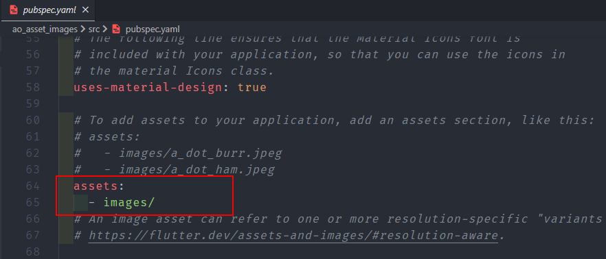

# Notes

> The `Image.asset()` named constructor creates a widget that displays an `[ImageStream]` obtained from an asset bundle.
>
> **_NOTE that the paths are relative to the `pubspec.yaml` file_**.
> To use the images like this, the images will need to be placed inside an `images` folder in the `src` directory & the `pubspec.yaml` file needs to be changed to expose the assets. Refer to the image below:



## Sample Code

```dart
import 'package:flutter/material.dart';

void main() {
  runApp(const MyApp());
}

class MyApp extends StatelessWidget {
  const MyApp({Key? key}) : super(key: key);
  @override
  Widget build(BuildContext context) {
    return MaterialApp(
      home: Scaffold(
        backgroundColor: Colors.blueGrey,
        appBar: AppBar(
          title: const Text("Asset Image"),
          backgroundColor: Colors.blueGrey[900],
        ), // AppBar
        body: Center(
          child: Image.asset('./images/bottle.jpg'),
        ), // Center
      ), // Scaffold
    ); // MaterialApp
  }
}


```

## Important Links

| Topic                              | Link                                        |
| ---------------------------------- | ------------------------------------------- |
| Images Widget - Widget of the Week | https://www.youtube.com/watch?v=7oIAs-0G4mw |
